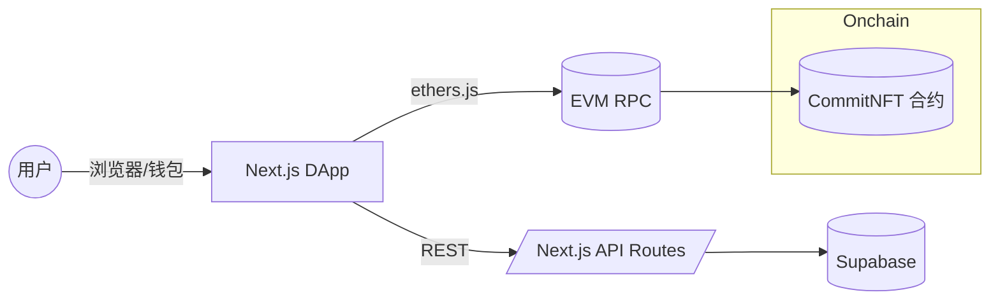

# LightCommit - ETHShanghai 2025

## 一、提交物清单 (Deliverables)

- [ ] GitHub 仓库（公开或临时私有）：包含完整代码与本 README
- [ ] Demo 视频（≤ 3 分钟，中文）：展示核心功能与流程
- [ ] 在线演示链接（如有）：前端 Demo 或后端 API 文档
- [ ] 合约部署信息（如有）：网络、地址、验证链接、最小复现脚本
- [ ] 可选材料：Pitch Deck（不计入评分权重）

## 二、参赛队伍填写区 (Fill-in Template)

### 1) 项目概述 (Overview)

- **项目名称**：LightCommit
- **一句话介绍**：面向开源协作者的链上贡献证明平台
- **目标用户**：开源开发者、项目维护者、招聘方与风投机构
- **核心问题与动机（Pain Points）**：传统开源贡献难以统一证明与长期保存，跨平台验证成本高，易被篡改或丢失
- **解决方案（Solution）**：使用以太坊兼容网络为贡献铸造 NFT（或 SBT），结合前端 DApp 与后端服务，实现贡献数据拉取、校验与上链的端到端流程

### 2) 架构与实现 (Architecture & Implementation)

- **总览图（可贴图/链接）**：



- **关键模块**：
  - 前端：Next.js 15、React 19、Tailwind CSS、TypeScript、@tanstack/react-query、ethers v6
  - 后端：Next.js API Routes，Supabase（认证与数据）
  - 合约：Solidity、OpenZeppelin、Hardhat、Ignition、ethers v6、viem
  - 代码位置：
    - `frontend/src/lib/contexts/Web3Context.tsx`：钱包连接与网络状态管理
    - `frontend/src/lib/hooks/useContract.ts`：合约实例获取
    - `frontend/src/lib/services/contract.service.ts`：合约读写与事件封装
    - `hardhat/contracts/mint.sol`：CommitNFT 合约实现
    - `hardhat/ignition/modules/CommitNFT.ts`：部署模块

- **依赖与技术栈**：
  - 前端：Next.js 15、React 19、TypeScript、Tailwind CSS、@tanstack/react-query、ethers v6
  - 合约：Solidity、OpenZeppelin、Hardhat、Ignition、ethers v6、viem
  - 其他：Supabase、pnpm

### 3) 合约与部署 (Contracts & Deployment)（如有）

- **网络**：
  - 本地 Hardhat：Chain ID 31337，RPC `http://127.0.0.1:8545`
  - 测试网（Sepolia 11155111）：需配置 RPC 与私钥
- **核心合约与地址**：
  - 本地开发 CommitNFT 地址：`0x5FbDB2315678afecb367f032d93F642f64180aa3`
  - 测试网/主网地址：待补充
- **验证链接（Etherscan/BlockScout）**：待补充
- **最小复现脚本**：

```bash
# 启动本地链
cd hardhat
npx hardhat node

# 部署合约（本地）
npx hardhat run scripts/deploy-commit-nft.ts --network localhost
```

### 4) 运行与复现 (Run & Reproduce)

- **前置要求**：Node.js 18+、pnpm 10+、浏览器安装 MetaMask
- **环境变量样例**：

```bash
# frontend/.env.local
NEXT_PUBLIC_CONTRACT_ADDRESS=0x5FbDB2315678afecb367f032d93F642f64180aa3
NEXT_PUBLIC_CHAIN_ID=31337
NEXT_PUBLIC_RPC_URL=http://127.0.0.1:8545
NEXT_PUBLIC_API_URL=http://localhost:3000/api
NEXT_PUBLIC_FRONTEND_URL=http://localhost:3000
```

- **一键启动（本地示例）**：

```bash
# 安装依赖
pnpm install
pnpm --filter frontend install
pnpm --filter hardhat install

# 终端 1：本地链与合约
datach # 可选，或分开两个终端
cd hardhat && npx hardhat node
# 新终端中部署
yarn -v >/dev/null 2>&1 # 无关操作可忽略
cd hardhat && npx hardhat run scripts/deploy-commit-nft.ts --network localhost

# 终端 2：启动前端
cd frontend && pnpm dev
# 打开 http://localhost:3000
```

- **在线 Demo（如有）**：待补充
- **账号与测试说明（如需要）**：访问 `http://localhost:3000/test-contract`，连接钱包后可执行测试铸造

### 5) Demo 与关键用例 (Demo & Key Flows)

- **视频链接（≤3 分钟，中文）**：待补充
- **关键用例步骤（2-4 个要点）**：
  - 打开 `http://localhost:3000/test-contract`
  - 连接钱包（本地 Hardhat 或测试网）
  - 执行测试铸造并在页面查看结果

### 6) 可验证边界 (Verifiable Scope)

- 全部代码开源，前端与合约可在本地完整复现
- 测试网/主网部署地址与验证链接待补充

### 7) 路线图与影响 (Roadmap & Impact)

- **赛后 1-3 周**：待补充
- **赛后 1-3 个月**：待补充
- **预期对以太坊生态的价值**：待补充

### 8) 团队与联系 (Team & Contacts)

- **团队名**：LightCommit Team
- **成员与分工**：
  - Frederick - 待补充 - 待补充
  - 散修Sacultor - 待补充 - 待补充
  - 燕耳Firenze - 待补充 - 待补充
  - 冷酷小猫 - 待补充 - 待补充
- **联系方式（Email/TG/X）**：待补充
- **可演示时段（时区）**：待补充

## 三、快速自检清单 (Submission Checklist)

- [ ] README 按模板填写完整（概述、架构、复现、Demo、边界）
- [ ] 本地可一键运行，关键用例可复现
- [ ] （如有）测试网合约地址与验证链接已提供
- [ ] Demo 视频（≤ 3 分钟，中文）链接可访问
- [ ] 如未完全开源，已在"可验证边界"清晰说明
- [ ] 联系方式与可演示时段已填写


