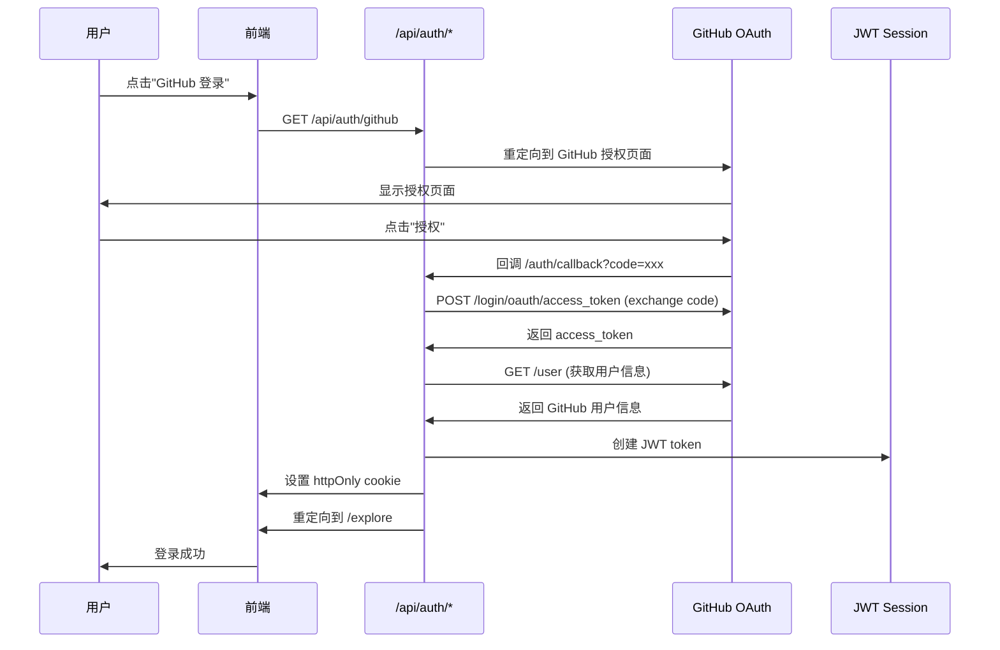

# GitHub OAuth 直接认证配置指南

本项目已从 Supabase Auth 迁移到**直接 GitHub OAuth + JWT Session**，完全掌控认证流程，无第三方依赖。

## 📋 概述

**技术栈**：
- GitHub OAuth 2.0
- JWT (jose 库)
- httpOnly Cookies
- Next.js App Router

**优势**：
- ✅ 无第三方认证服务依赖
- ✅ 完全掌控认证流程
- ✅ 更轻量、更快
- ✅ 省钱（无 Supabase 费用）

---

## 🚀 快速开始

### 1. 注册 GitHub OAuth App

访问 [GitHub Developer Settings](https://github.com/settings/developers)：

1. 点击 **New OAuth App**
2. 填写信息：
   ```
   Application name: LightCommit (或你的应用名)
   Homepage URL: http://localhost:3000
   Authorization callback URL: http://localhost:3000/auth/callback
   ```
3. 创建后获取：
   - **Client ID**
   - **Client Secret**（点击 Generate new client secret）

### 2. 配置环境变量

在 `frontend/.env` 中添加：

```bash
# GitHub OAuth 配置
GITHUB_CLIENT_ID=你的_Client_ID
GITHUB_CLIENT_SECRET=你的_Client_Secret

# JWT 密钥（至少 32 字符，生产环境务必使用强密钥）
JWT_SECRET=your-super-secret-jwt-key-min-32-characters-long

# 前端地址（可选，默认 localhost:3000）
NEXT_PUBLIC_FRONTEND_URL=http://localhost:3000
```

### 3. 生成安全的 JWT_SECRET

```bash
# macOS/Linux
openssl rand -base64 32

# 或使用 Node.js
node -e "console.log(require('crypto').randomBytes(32).toString('base64'))"
```

### 4. 启动项目

```bash
cd frontend
pnpm dev
```

访问 http://localhost:3000，点击"GitHub 登录"测试。

---

## 🔄 认证流程



---

## 📁 文件结构

```
frontend/src/
├── lib/
│   └── auth/
│       └── session.ts              # JWT session 管理（核心）
├── app/
│   ├── api/
│   │   └── auth/
│   │       ├── github/route.ts     # 发起 GitHub OAuth
│   │       ├── callback/route.ts   # 处理 GitHub 回调
│   │       ├── user/route.ts       # 获取当前用户
│   │       └── logout/route.ts     # 登出
│   └── auth/
│       └── callback/page.tsx       # 回调页面（重定向到 API）
└── lib/
    └── services/
        └── auth.service.ts         # 认证服务（前端调用）
```

---

## 🔐 安全性

### JWT Session 配置

```typescript
// lib/auth/session.ts
const SESSION_CONFIG = {
  cookieName: 'lightcommit_session',
  maxAge: 30 * 24 * 60 * 60,        // 30 天
  httpOnly: true,                    // 防止 XSS
  secure: true,                      // HTTPS only（生产环境）
  sameSite: 'lax',                   // CSRF 防护
};
```

### 安全建议

1. **JWT_SECRET**：
   - 至少 32 字符
   - 生产环境使用强随机密钥
   - 不要提交到 Git

2. **HTTPS**：
   - 生产环境必须使用 HTTPS
   - 确保 `secure: true` 生效

3. **Token 过期**：
   - 默认 30 天
   - 可根据需求调整 `maxAge`

4. **CSRF 防护**：
   - `sameSite: 'lax'` 防止跨站请求
   - OAuth state 参数（可选）

---

## 🛠️ API 接口说明

### 1. GET /api/auth/github
发起 GitHub OAuth 流程，重定向到 GitHub 授权页面。

### 2. GET /api/auth/callback?code=xxx
处理 GitHub 回调：
- 用 code 交换 access_token
- 获取用户信息
- 创建 JWT session
- 设置 cookie
- 重定向到 /explore

### 3. GET /api/auth/user
获取当前用户信息（从 JWT 读取）。

**返回**：
```json
{
  "session": {
    "user": {
      "id": 12345,
      "login": "username",
      "name": "Name",
      "email": "user@example.com",
      "avatar_url": "https://..."
    },
    "accessToken": "gho_xxx",
    "createdAt": 1234567890,
    "expiresAt": 1237159890
  }
}
```

### 4. POST /api/auth/logout
登出，清除 JWT session cookie。

---

## 🔄 从 Supabase 迁移

### 已移除的依赖

- `@supabase/supabase-js`
- `@supabase/ssr`

### 已修改的文件

- ✅ `lib/auth/session.ts` - 新增 JWT 管理
- ✅ `app/api/auth/github/route.ts` - 直接 OAuth
- ✅ `app/api/auth/callback/route.ts` - 新增回调处理
- ✅ `app/api/auth/user/route.ts` - 从 JWT 读取
- ✅ `app/api/auth/logout/route.ts` - 清除 JWT
- ✅ `lib/services/auth.service.ts` - 移除 Supabase

### 数据库兼容性

- 用户信息仍可同步到数据库（可选）
- `/api/users/sync` 接口保持不变
- 不影响现有的贡献记录和 NFT 数据

---

## 🧪 测试

### 1. 本地测试

```bash
# 启动前端
cd frontend
pnpm dev

# 访问
open http://localhost:3000

# 点击"GitHub 登录"
```

### 2. 验证 JWT

```bash
# 查看 cookie（浏览器开发者工具）
Application > Cookies > lightcommit_session

# 解码 JWT（仅查看 payload，不验证签名）
echo "your_jwt_token" | cut -d'.' -f2 | base64 -d | jq
```

### 3. API 测试

```bash
# 获取当前用户（需要先登录）
curl -X GET http://localhost:3000/api/auth/user \
  -H "Cookie: lightcommit_session=your_jwt_token"

# 登出
curl -X POST http://localhost:3000/api/auth/logout \
  -H "Cookie: lightcommit_session=your_jwt_token"
```

---

## ❓ 常见问题

### Q1: 为什么不用 Supabase？
- 减少依赖，完全掌控
- 省钱（无第三方费用）
- 更轻量、更快

### Q2: JWT 安全吗？
- ✅ httpOnly cookie 防止 XSS
- ✅ secure + sameSite 防止 CSRF
- ✅ 定期过期（30 天）
- ✅ 强密钥签名

### Q3: 如何支持多个 OAuth Provider？
- 添加对应的 `/api/auth/google` 等路由
- 统一的 JWT session 格式
- 或使用 NextAuth.js

### Q4: 如何刷新 Token？
- 当前实现：Session 过期后重新登录
- 可扩展：实现 refresh token 机制

### Q5: 数据库还能用吗？
- 可以！用户信息同步到数据库不受影响
- `/api/users/sync` 接口保持兼容

---

## 📚 相关文档

- [GitHub OAuth Documentation](https://docs.github.com/en/apps/oauth-apps/building-oauth-apps/authorizing-oauth-apps)
- [jose (JWT Library)](https://github.com/panva/jose)
- [Next.js Cookies](https://nextjs.org/docs/app/api-reference/functions/cookies)

---

## 🎉 完成！

现在你的项目已经使用直接 GitHub OAuth + JWT Session 认证，无需 Supabase！

如有问题，请查看日志或提 Issue。

