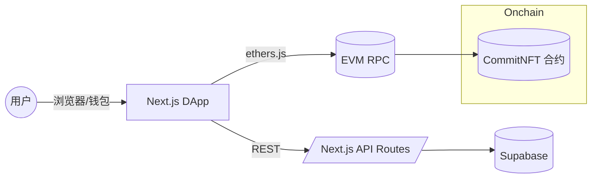

### LightCommit 项目说明

#### 文档索引

- `docs/overview.md` 概览与架构
- `docs/setup.md` 环境配置与快速开始
- `docs/frontend.md` 前端结构与约定
- `docs/api.md` API 规范
- `docs/database.md` 数据库与迁移
- `docs/contracts.md` 合约与链上交互
- `docs/deployment.md` 部署与运维
- `docs/contributing.md` 贡献指南

#### 项目概述

- **名称**: LightCommit
- **介绍**: 面向开源协作者的链上贡献证明平台，通过智能合约为每一次 GitHub 贡献铸造可验证的 NFT 资产，形成不可篡改的贡献记录。
- **目标用户**: 开源开发者、项目维护者、招聘方与风投机构。
- **问题与解决方案**:
  - **问题**: 传统开源贡献难以统一证明与长期保存，跨平台验证成本高，易被篡改或丢失。
  - **解决方案**: 使用以太坊兼容网络为贡献铸造 NFT（或 SBT），结合前端 DApp 与后端服务，实现贡献数据拉取、校验与上链的端到端流程。

#### 架构与实现

- **总览**:
  - 前端 `frontend` 使用 Next.js 15 + React 19 + Tailwind CSS，负责钱包连接、贡献展示与铸造流程。
  - 合约与部署在 `hardhat`，使用 Hardhat Ignition 部署 `CommitNFT` 合约。
  - 数据与认证集成 Supabase（前端已集成 `@supabase/supabase-js`，实际密钥需配置）。

- **关键模块**:
  - `frontend/src/lib/contexts/Web3Context.tsx`: 钱包连接与网络状态管理
  - `frontend/src/lib/hooks/useContract.ts`: 合约实例获取
  - `frontend/src/lib/services/contract.service.ts`: 合约读写与事件封装
  - `hardhat/contracts/mint.sol`: CommitNFT 合约实现
  - `hardhat/ignition/modules/CommitNFT.ts`: 部署模块

- **技术栈**:
  - 前端: Next.js 15、React 19、TypeScript、Tailwind CSS、@tanstack/react-query、ethers v6
  - 合约: Solidity、OpenZeppelin、Hardhat、Ignition、ethers v6、viem
  - 其他: Supabase、pnpm

#### 合约与部署信息

- **网络**:
  - 本地 Hardhat: Chain ID 31337，RPC `http://127.0.0.1:8545`
  - 测试网（推荐 Sepolia 11155111）: 需配置 RPC 与私钥

- **地址**:
  - 本地开发 CommitNFT 地址: `0x5FbDB2315678afecb367f032d93F642f64180aa3`
  - 测试网/主网地址: 待部署后补充

- **验证链接**:
  - 本地无区块浏览器
  - 测试网/主网: 部署后补充对应 Etherscan/Snowtrace/Polygonscan 链接

#### 运行与复现说明

- **环境要求**:
  - Node.js 18+
  - pnpm 10+
  - 浏览器安装 MetaMask

- **安装依赖**:
  ```bash
  pnpm install
  pnpm --filter frontend install
  pnpm --filter hardhat install
  ```

- **准备环境变量**:
  在 `frontend` 目录创建 `.env.local`，示例见 `frontend/ENV_SETUP.md`。本地最小配置示例：
  ```bash
  NEXT_PUBLIC_CONTRACT_ADDRESS=0x5FbDB2315678afecb367f032d93F642f64180aa3
  NEXT_PUBLIC_CHAIN_ID=31337
  NEXT_PUBLIC_RPC_URL=http://127.0.0.1:8545
  NEXT_PUBLIC_API_URL=http://localhost:3000/api
  NEXT_PUBLIC_FRONTEND_URL=http://localhost:3000
  ```

- **启动本地链**:
  ```bash
  cd hardhat
  npx hardhat node
  ```

- **部署合约（本地）**:
  ```bash
  cd hardhat
  npx hardhat run scripts/deploy-commit-nft.ts --network localhost
  ```

- **启动前端**:
  ```bash
  cd frontend
  pnpm dev
  ```

- **测试页面**:
  - 访问: `http://localhost:3000/test-contract`
  - 连接钱包后可执行测试铸造

- **部署到 Sepolia（可选）**:
  1. 在 `hardhat/.env` 配置：
     ```bash
     SEPOLIA_RPC_URL=https://sepolia.infura.io/v3/<YOUR_PROJECT_ID>
     SEPOLIA_PRIVATE_KEY=<YOUR_PRIVATE_KEY>
     ```
  2. 部署：
     ```bash
     cd hardhat
     npx hardhat run scripts/deploy-commit-nft.ts --network sepolia
     ```
  3. 更新前端 `.env.local`：
     ```bash
     NEXT_PUBLIC_CONTRACT_ADDRESS=<新地址>
     NEXT_PUBLIC_CHAIN_ID=11155111
     NEXT_PUBLIC_RPC_URL=https://sepolia.infura.io/v3/<YOUR_PROJECT_ID>
     NEXT_PUBLIC_EXPLORER_URL=https://sepolia.etherscan.io
     ```

#### 架构总览图



#### 路线图与影响（Roadmap & Impact）

- Phase 1：MVP（2025 Q4）
  - 目标：验证核心假设，获取 1000 早期用户
  - 交付：GitHub OAuth、Polygon 测试网部署、基础铸造、Web 界面、反女巫 v1
  - 指标：注册开发者 1,000+；NFT 铸造 5,000+；女巫检出率 >80%

- Phase 2：Beta（2026 Q1-Q2）
  - 目标：完善核心功能，启动 DAO 治理
  - 交付：zk 证明、DAO 金库自动分配、Issue 悬赏、移动端、反女巫 v2、主网部署
  - 指标：注册开发者 10,000+；月活跃铸造 20,000+；DAO 金库余额 $50,000+

- Phase 3：全面发布（2026 Q3-Q4）
  - 目标：跨链扩展，生态整合
  - 交付：Base/Arbitrum 部署、跨链声誉聚合、Lens 集成、企业 API、分析仪表盘、$LIGHT（如通过）
  - 指标：注册开发者 50,000+；月铸造量 100,000+；DAO 金库 $500,000+；企业客户 10+

- Phase 4：未来愿景（2027+）
  - 方向：AI 辅助验证、链下贡献支持（GitLab/Bitbucket/非代码）、DeFi 整合、全球化与合规

- 预期影响
  - 更及时激励：从季度资助缩短至实时-每周
  - 更可靠证明：链上不可篡改凭证 + 可选 zk 隐私
  - 更可持续经济：协议费用自循环驱动长期激励

#### 团队与联系信息

- 团队: LightCommit Team
Frederick，散修Sacultor，燕耳Firenze，冷酷小猫
- 项目仓库: `https://github.com/your-username/lightcommit`

——

若需补充测试网/主网合约地址与验证链接，请提供部署交易哈希或区块浏览器链接。


