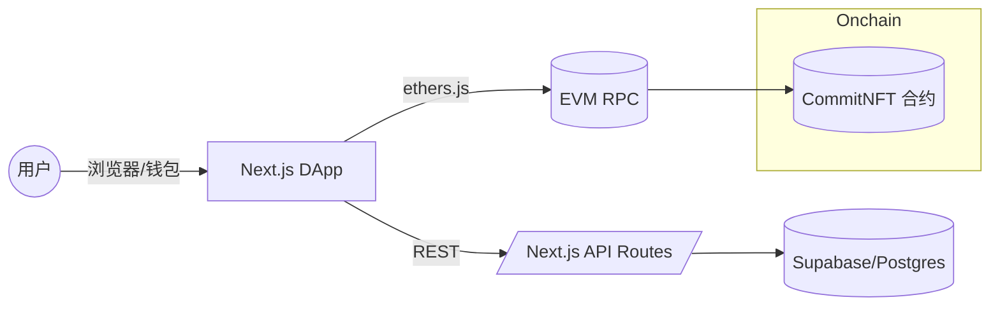

### 概览

**LightCommit** 是一个面向开源协作者的链上贡献证明平台。前端基于 Next.js 15，结合 Supabase 进行认证与数据存储，合约侧使用 Hardhat 部署 `CommitNFT` 实现将 GitHub 贡献铸造成可验证的 NFT。

### 架构

### 技术栈

- 前端: Next.js 15、React 19、TypeScript、Tailwind CSS、ethers v6、@tanstack/react-query
- 后端/API: Next.js App Router API Routes、Supabase
- 合约: Solidity、OpenZeppelin、Hardhat、Ignition、viem

### 目录结构

- `frontend/src/app/api` 接口路由
- `frontend/src/lib` 上下文、服务、数据库访问、Supabase 集成、配置
- `hardhat` 合约、部署脚本、Ignition 模块与测试
- `docs` 技术文档

### 核心流程

- 认证: `GET /api/auth/github` 触发 GitHub OAuth，`/auth/callback` 完成回调，`AuthService.getServerUser` 在服务端读取用户
- 贡献采集: `POST /api/github/webhook` 验证签名后调用 `GitHubService.handleWebhook` 写入 `contributions`
- 数据查询: `GET /api/contributions`、`/api/contributions/my`、`/api/contributions/[id]`、`/api/contributions/stats`
- 链上铸造: 前端通过 `useContract` 获取合约实例，`ContractService.mintCommit` 或 `batchMintCommits`

### 关键代码定位

- 认证: `frontend/src/lib/supabase/client.ts`、`frontend/src/lib/supabase/server.ts`、`frontend/src/middleware.ts`
- API: `frontend/src/app/api/*`
- 服务: `frontend/src/lib/services/*.ts`
- 合约: `hardhat/contracts/mint.sol`、`hardhat/ignition/modules/CommitNFT.ts`

